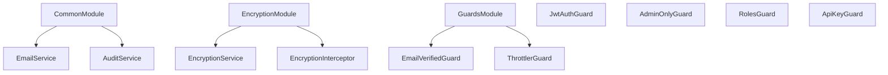

# Common Components

The `src/common` directory contains reusable components, utilities, and services that are used across the application. These components provide core functionality such as authentication, authorization, encryption, and more.

## Module Structure



## Core Modules

### CommonModule

The `CommonModule` is a global module that provides shared services across the application:

```typescript
@Global()
@Module({
  imports: [
    ConfigModule,
    CacheModule.register({
      ttl: 60000, // 1 minute default TTL
    }),
  ],
  providers: [EmailService, AuditService, PrismaService],
  exports: [EmailService, AuditService, CacheModule],
})
export class CommonModule {}
```

### EncryptionModule

The `EncryptionModule` handles data encryption and decryption throughout the application:

```typescript
@Global()
@Module({
  providers: [EncryptionService, EncryptionInterceptor],
  exports: [EncryptionService, EncryptionInterceptor],
})
export class EncryptionModule {}
```

### GuardsModule

The `GuardsModule` provides authentication and authorization guards:

```typescript
@Module({
  imports: [PrismaModule],
  providers: [EmailVerifiedGuard, ThrottlerGuard],
  exports: [EmailVerifiedGuard, ThrottlerGuard],
})
export class GuardsModule {}
```

## Guards

Guards are used to control access to routes and endpoints based on certain conditions.

### JwtAuthGuard

The `JwtAuthGuard` verifies JWT authentication tokens:

```typescript
@Injectable()
export class JwtAuthGuard extends AuthGuard('jwt') {
  canActivate(context: ExecutionContext) {
    // Add custom logic here if needed
    return super.canActivate(context);
  }

  handleRequest(err, user, info) {
    // You can throw an exception based on either "info" or "err" arguments
    if (err || !user) {
      throw err || new UnauthorizedException('Authentication required');
    }
    return user;
  }
}
```

### AdminOnlyGuard

The `AdminOnlyGuard` restricts access to admin users only:

```typescript
@Injectable()
export class AdminOnlyGuard implements CanActivate {
  canActivate(context: ExecutionContext): boolean {
    const request = context.switchToHttp().getRequest();
    const user = request.user;

    // Ensure user exists and has a role
    if (!user || !user.role) {
      throw new ForbiddenException('Access denied');
    }

    // Check if user has admin permissions
    const isAdmin = user.role === Role.ADMIN || user.role === Role.SUPER_ADMIN;

    if (!isAdmin) {
      throw new ForbiddenException(
        'This action requires administrator privileges',
      );
    }

    return true;
  }
}
```

### RolesGuard

The `RolesGuard` implements role-based access control:

```typescript
@Injectable()
export class RolesGuard implements CanActivate {
  constructor(private reflector: Reflector) {}

  canActivate(context: ExecutionContext): boolean {
    const requiredRoles = this.reflector.getAllAndOverride<Role[]>(ROLES_KEY, [
      context.getHandler(),
      context.getClass(),
    ]);

    if (!requiredRoles) {
      return true;
    }

    const { user } = context.switchToHttp().getRequest();
    return requiredRoles.some((role) => user?.role === role);
  }
}
```

### ThrottlerGuard

The `ThrottlerGuard` implements rate limiting to prevent abuse:

```typescript
@Injectable()
export class ThrottlerGuard extends NestThrottlerGuard {
  // Override the getTracker method to customize how we track rate limits
  protected getTracker(context: ExecutionContext): Promise<string> {
    // Get the request object
    const request = context.switchToHttp().getRequest();

    // Use X-Forwarded-For header if available (for when behind a proxy/load balancer)
    // Otherwise fall back to the client's IP address
    const ip = request.headers['x-forwarded-for'] || request.ip;

    // Return a unique identifier for this client
    return Promise.resolve(ip);
  }
}
```

### EmailVerifiedGuard

The `EmailVerifiedGuard` ensures that users have verified their email address:

```typescript
@Injectable()
export class EmailVerifiedGuard implements CanActivate {
  constructor(private readonly prisma: PrismaService) {}

  async canActivate(context: ExecutionContext): Promise<boolean> {
    const request = context.switchToHttp().getRequest();
    const user = request.user;

    if (!user) {
      throw new UnauthorizedException('User not authenticated');
    }

    const userRecord = await this.prisma.user.findUnique({
      where: { id: user.userId || user.id },
    });

    if (!userRecord) {
      throw new UnauthorizedException('User not found');
    }

    if (!userRecord.emailVerified) {
      throw new UnauthorizedException(
        'Email verification required. Please verify your email address before performing this action.',
      );
    }

    return true;
  }
}
```

### ApiKeyGuard

The `ApiKeyGuard` implements API key authentication:

```typescript
@Injectable()
export class ApiKeyGuard implements CanActivate {
  constructor(private configService: ConfigService) {}

  canActivate(context: ExecutionContext): boolean {
    const request = context.switchToHttp().getRequest();
    const apiKey = request.headers['x-api-key'];
    const validApiKey = this.configService.get<string>('NEWSLETTER_API_KEY');

    if (!apiKey || apiKey !== validApiKey) {
      throw new UnauthorizedException('Invalid API key');
    }

    return true;
  }
}
```

## Decorators

Decorators provide a way to add metadata to classes and class members.

### GetUser

The `GetUser` decorator extracts the user from the request object:

```typescript
export const GetUser = createParamDecorator(
  (data: string | undefined, ctx: ExecutionContext) => {
    const request = ctx.switchToHttp().getRequest();
    const user = request.user;

    // If data is provided, return that specific property from user
    return data ? user[data] : user;
  },
);
```

### Roles

The `Roles` decorator specifies required roles for access control:

```typescript
export const ROLES_KEY = 'roles';
export const Roles = (...roles: Role[]) => SetMetadata(ROLES_KEY, roles);
```

### Throttle

The `Throttle` decorators provide rate limiting options:

```typescript
export const Throttle = (limit: number, ttl: number, name?: string) => {
  const options = name
    ? { [name]: { limit, ttl } }
    : { default: { limit, ttl } };

  return NestThrottle(options);
};

export const SensitiveThrottle = () =>
  NestThrottle({
    sensitive: { limit: 5, ttl: 900000 },
  });
```

## Interceptors

Interceptors provide a way to intercept and modify requests and responses.

### EncryptionInterceptor

The `EncryptionInterceptor` handles encryption and decryption of sensitive data:

```typescript
@Injectable()
export class EncryptionInterceptor implements NestInterceptor {
  constructor(private readonly encryptionService: EncryptionService) {}

  async intercept(
    context: ExecutionContext,
    next: CallHandler,
  ): Promise<Observable<any>> {
    const request = context.switchToHttp().getRequest();
    const isRegisterEndpoint = request.path === '/api/v1/auth/register';

    // For registration endpoint, let validation happen first
    if (!isRegisterEndpoint && request.body) {
      // Decrypt incoming sensitive data for non-registration endpoints
      await this.decryptSensitiveData(request.body);
    }

    return next.handle().pipe(
      map(async (data) => {
        if (!data) return data;

        // For all responses, encrypt sensitive data
        const processedData = await this.encryptSensitiveData(data);
        return processedData;
      }),
    );
  }
}
```

## Services

Services implement the business logic of the application.

### EmailService

The `EmailService` handles sending emails:

```typescript
@Injectable()
export class EmailService {
  private transporter: nodemailer.Transporter;
  private readonly logger = new Logger(EmailService.name);
  private testAccount: any;

  constructor(private configService: ConfigService) {
    this.initializeTransporter();
  }

  async sendPasswordResetEmail(email: string, token: string): Promise<void> {
    const resetLink = `${this.configService.get<string>('FRONTEND_URL') || 'http://localhost:3000'}/reset-password?token=${token}`;

    const info = await this.transporter.sendMail({
      from:
        this.configService.get<string>('SMTP_FROM') || 'noreply@curiopay.com',
      to: email,
      subject: 'Password Reset Request',
      html: `
        <h1>Password Reset Request</h1>
        <p>You have requested to reset your password. Click the link below to proceed:</p>
        <a href="${resetLink}">Reset Password</a>
        <p>If you did not request this password reset, please ignore this email.</p>
        <p>This link will expire in 1 hour.</p>
      `,
    });
  }
}
```

### EncryptionService

The `EncryptionService` provides methods for encrypting and decrypting data:

```typescript
@Injectable()
export class EncryptionService {
  private readonly algorithm = 'aes-256-gcm';
  private readonly keyLength = 32;
  private readonly ivLength = 16;
  private readonly saltLength = 32;
  private readonly authTagLength = 16;

  constructor() {
    // Ensure encryption key is set
    if (!process.env.ENCRYPTION_KEY) {
      throw new Error('ENCRYPTION_KEY environment variable must be set');
    }
  }

  async encrypt(data: string): Promise<string> {
    try {
      // Generate a random salt
      const salt = randomBytes(this.saltLength);

      // Generate key using scrypt
      const key = (await promisify(scrypt)(
        process.env.ENCRYPTION_KEY as BinaryLike,
        salt,
        this.keyLength,
      )) as CipherKey;

      // Generate IV
      const iv = randomBytes(this.ivLength);

      // Create cipher
      const cipher = createCipheriv(this.algorithm, key, iv);

      // Encrypt the data
      const encryptedData = Buffer.concat([
        cipher.update(data, 'utf8'),
        cipher.final(),
      ]);

      // Get auth tag
      const authTag = cipher.getAuthTag();

      // Combine all components
      const combined = Buffer.concat([salt, iv, authTag, encryptedData]);

      // Return as base64 string
      return combined.toString('base64');
    } catch (error) {
      throw new Error(`Encryption failed: ${error.message}`);
    }
  }
}
```

## Base Classes

### BaseController

The `BaseController` provides common functionality for controllers:

```typescript
@ApiBearerAuth('JWT-auth')
@ApiUnauthorizedResponse({
  description: 'Unauthorized - Valid JWT token is required',
  schema: {
    type: 'object',
    properties: {
      message: {
        type: 'string',
        example: 'Unauthorized',
      },
      statusCode: {
        type: 'number',
        example: 401,
      },
      error: {
        type: 'string',
        example: 'Unauthorized',
      },
    },
  },
})
export class BaseController {}
```
