# Database Schema

The CurioPay API uses PostgreSQL with Prisma as the ORM. The database schema is designed to efficiently support financial transaction tracking, user management, and security requirements.

## Entity Relationship Diagram

```mermaid
erDiagram
    %% Core User and Authentication
    User {
        string id PK
        string email UK
        Role role
        boolean isActive
        datetime emailVerified
        datetime lastLoginAt
        string provider
        string providerAccountId
        string firstName
        string lastName
        boolean isDeleted
        int securityLevel
        string dataRegion
        datetime createdAt
        datetime updatedAt
    }

    UserAuth {
        string id PK
        string userId UK,FK
        string password
        string passwordSalt
        string passwordResetToken
        datetime passwordResetExpires
        string emailVerificationToken
        datetime emailVerificationTokenExpiry
        int failedLoginAttempts
        datetime lastFailedLoginAt
        datetime lockedUntil
        int passwordHashVersion
        boolean mfaEnabled
        string mfaSecret
        string[] backupCodes
        datetime lastPasswordChange
        boolean isDeleted
        json securityAuditLog
        datetime createdAt
        datetime updatedAt
    }

    UserContact {
        string id PK
        string userId UK,FK
        string firstName
        string lastName
        string phone UK
        string avatarUrl
        DataEncryptionStatus encryptionStatus
        datetime createdAt
        datetime updatedAt
    }

    Session {
        string id PK
        string userId FK
        string sessionToken UK
        datetime expires
        datetime createdAt
        datetime updatedAt
    }

    %% Financial Core Entities
    Expense {
        string id PK
        datetime date
        string description
        decimal amount
        string categoryId FK
        string paymentMethodId FK
        string notes
        string userId FK
        boolean isVoid
        string voidReason
        decimal originalAmount
        string partitionKey
        json auditLog
        int securityLevel
        datetime createdAt
        datetime updatedAt
    }

    Income {
        string id PK
        datetime date
        string description
        decimal amount
        string categoryId FK
        string paymentMethodId FK
        string notes
        string userId FK
        boolean isVoid
        string voidReason
        decimal originalAmount
        string partitionKey
        json auditLog
        int securityLevel
        datetime createdAt
        datetime updatedAt
    }

    Category {
        string id PK
        string name
        string typeId FK
        string icon
        string color
        string userId FK
        float budget
        boolean isDefault
        boolean isSystem
        datetime createdAt
        datetime updatedAt
    }

    CategoryType {
        string id PK
        string name UK
        string icon
        datetime createdAt
        datetime updatedAt
    }

    PaymentMethod {
        string id PK
        PaymentMethodEnum name
        string icon
        string userId FK
        boolean isDefault
        boolean isSystem
        datetime createdAt
        datetime updatedAt
    }

    %% Recurring Transactions
    RecurringPattern {
        string id PK
        RecurringType type
        int frequency
        int dayOfWeek
        int dayOfMonth
        int monthOfYear
        datetime createdAt
        datetime updatedAt
    }

    RecurringExpense {
        string id PK
        string expenseId UK,FK
        string patternId FK
        datetime startDate
        datetime endDate
        datetime lastProcessed
        datetime nextProcessDate
        datetime createdAt
        datetime updatedAt
    }

    RecurringIncome {
        string id PK
        string incomeId UK,FK
        string patternId FK
        datetime startDate
        datetime endDate
        datetime lastProcessed
        datetime nextProcessDate
        datetime createdAt
        datetime updatedAt
    }

    %% Receipts and Documentation
    Receipt {
        string id PK
        string expenseId UK,FK
        string fileUrl
        string fileName
        int fileSize
        string mimeType
        datetime createdAt
        datetime updatedAt
    }

    %% User Preferences and Settings
    UserPreference {
        string id PK
        string userId UK,FK
        string currencyId FK
        string languageId FK
        string themeId FK
        float monthlyBudget
        boolean enableAiFeatures
        datetime createdAt
        datetime updatedAt
    }

    Currency {
        string id PK
        string code UK
        string symbol
        string name
        datetime createdAt
        datetime updatedAt
    }

    Language {
        string id PK
        string code UK
        string name
        datetime createdAt
        datetime updatedAt
    }

    Theme {
        string id PK
        string name UK
        datetime createdAt
        datetime updatedAt
    }

    %% Notifications
    NotificationSetting {
        string id PK
        string userId FK
        NotificationType type
        boolean enabled
        datetime createdAt
        datetime updatedAt
    }

    %% Newsletter and Communications
    NewsletterSubscription {
        string id PK
        string userId UK,FK
        boolean weeklyDigest
        boolean promotionalEmails
        boolean productUpdates
        datetime unsubscribedAt
        datetime createdAt
        datetime updatedAt
    }

    %% Security and Audit
    AuditLog {
        string id PK
        string userId FK
        string action
        string category
        string ipAddress
        string userAgent
        string status
        json details
        datetime timestamp
        string logIntegrityHash
        boolean isCritical
    }

    VerificationToken {
        string identifier
        string token UK
        datetime expires
    }

    %% Relationships
    User ||--o| UserAuth : "has authentication"
    User ||--o| UserContact : "has contact info"
    User ||--o{ Session : "has sessions"
    User ||--o| UserPreference : "has preferences"
    User ||--o{ Expense : "creates expenses"
    User ||--o{ Income : "receives income"
    User ||--o{ Category : "owns categories"
    User ||--o{ PaymentMethod : "has payment methods"
    User ||--o{ NotificationSetting : "has notification settings"
    User ||--o| NewsletterSubscription : "has newsletter subscription"
    User ||--o{ AuditLog : "generates audit logs"

    Category ||--o{ Expense : "categorizes"
    Category ||--o{ Income : "categorizes"
    Category }o--|| CategoryType : "belongs to type"
    Category }o--|| User : "owned by"

    PaymentMethod ||--o{ Expense : "used for expenses"
    PaymentMethod ||--o{ Income : "used for income"
    PaymentMethod }o--|| User : "owned by"

    Expense ||--o| Receipt : "has receipt"
    Expense ||--o| RecurringExpense : "can be recurring"

    Income ||--o| RecurringIncome : "can be recurring"

    RecurringExpense }o--|| RecurringPattern : "follows pattern"
    RecurringIncome }o--|| RecurringPattern : "follows pattern"

    UserPreference }o--|| Currency : "uses currency"
    UserPreference }o--|| Language : "uses language"
    UserPreference }o--|| Theme : "uses theme"

    NotificationSetting }o--|| User : "belongs to user"
```

## Key Database Models

### Users and Authentication

- **User**: Core entity that represents a user in the system
- **UserAuth**: Authentication-related data including password hashes and MFA settings
- **UserContact**: Contact information for users
- **UserPreference**: User preferences including language, theme, and currency
- **Session**: User session data
- **VerificationToken**: Tokens for email verification and password reset

### Financial Data

- **Expense**: Records of user expenses
- **Income**: Records of user income
- **Category**: Categories for expenses and income
- **CategoryType**: Types of categories (expense or income)
- **PaymentMethod**: Payment methods used for transactions

### Recurring Transactions

- **RecurringPattern**: Patterns for recurring transactions
- **RecurringExpense**: Configuration for expenses that recur regularly
- **RecurringIncome**: Configuration for income that recurs regularly

### Support Features

- **Receipt**: Receipts attached to expenses
- **Currency**: Available currencies
- **Language**: Available languages
- **Theme**: Available themes
- **NewsletterSubscription**: Newsletter subscription preferences
- **AuditLog**: Audit trail of important system events

## Data Security Features

- Encrypted sensitive data
- Row-level security with securityLevel field
- Soft delete pattern with isDeleted flag
- Performance optimization with strategic indexes
- Data partitioning for large tables (expenses, income)

## Database Migrations

Database schema evolution is managed through Prisma migrations. Recent migrations include:

- Performance indexes
- Newsletter subscription functionality
- Audit logging
- AI features preferences
- Email verification
- Payment methods structure updates
