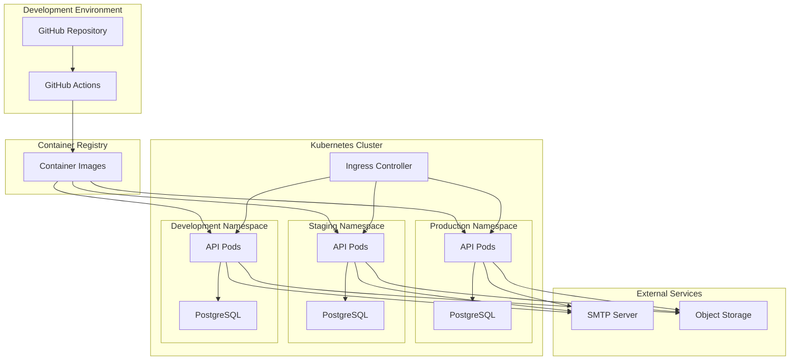
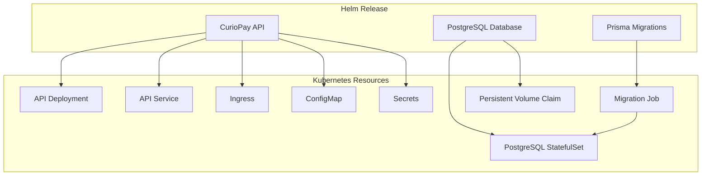
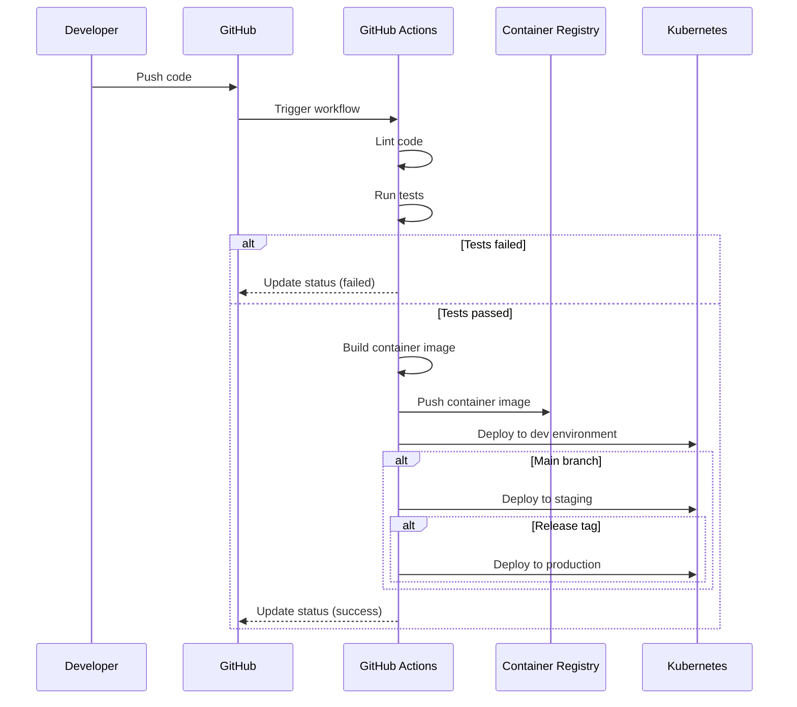
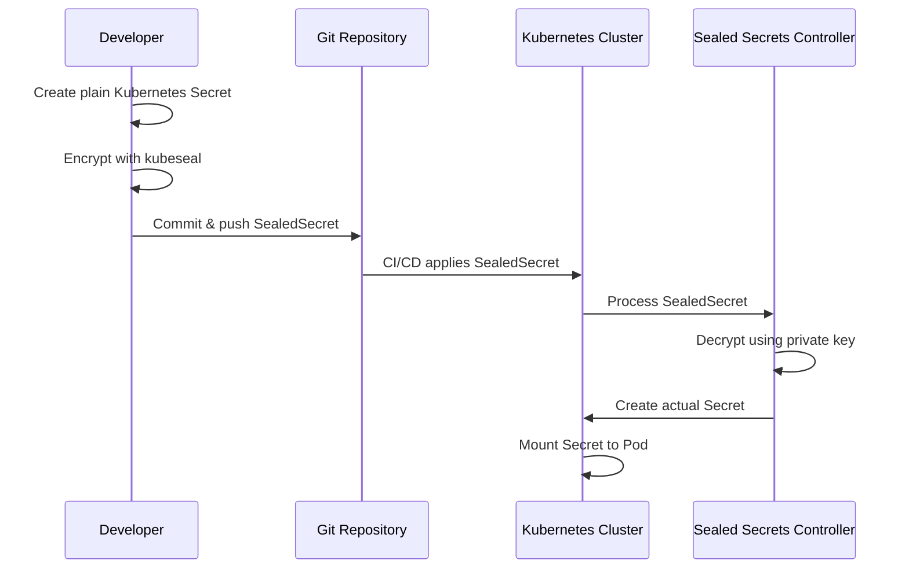
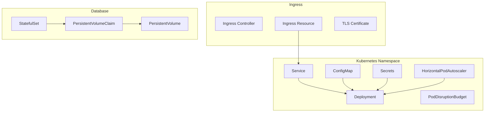

# Deployment Architecture

The CurioPay API is deployed using a containerized approach with Kubernetes as the orchestration platform. This document outlines the deployment architecture and infrastructure components.

## Deployment Overview



## Deployment Methods

CurioPay API supports two primary deployment methods:

### Kubernetes with Kustomize

Uses Kustomize for GitOps-friendly deployment with environment overlays:

```
k8s/
├── base/                   # Base configuration (common across environments)
│   ├── deployment.yaml     # Base deployment spec
│   ├── service.yaml        # Service definition
│   ├── configmap.yaml      # Non-sensitive configuration
│   ├── ingress.yaml        # Ingress rules
│   ├── hpa.yaml            # Horizontal Pod Autoscaler
│   └── kustomization.yaml  # Base kustomization file
├── overlays/               # Environment-specific configurations
│   ├── dev/                # Development environment
│   │   ├── kustomization.yaml
│   │   ├── deployment-patch.yaml
│   │   ├── configmap-patch.yaml
│   │   └── sealed-secrets.yaml  # Encrypted secrets for dev
│   ├── staging/            # Staging environment
│   │   ├── kustomization.yaml
│   │   ├── deployment-patch.yaml
│   │   ├── configmap-patch.yaml
│   │   └── sealed-secrets.yaml  # Encrypted secrets for staging
│   └── prod/               # Production environment
│       ├── kustomization.yaml
│       ├── deployment-patch.yaml
│       ├── configmap-patch.yaml
│       └── sealed-secrets.yaml  # Encrypted secrets for production
```

### Helm Charts

Uses Helm for complete deployment including database and migrations:



## CI/CD Pipeline



## Secret Management

For secure GitOps workflows, the project uses Bitnami Sealed Secrets:



## Infrastructure Components

### Kubernetes Resources



## Scaling and Resilience

The application is designed for horizontal scaling and resilience:

- Horizontal Pod Autoscaler (HPA) adjusts the number of pods based on CPU/memory utilization
- Pod Disruption Budget (PDB) ensures high availability during maintenance
- Liveness and readiness probes monitor application health
- Request rate limiting protects against traffic spikes

> **⚠️ SECURITY WARNING**: Both deployment configurations contain example credentials. Always replace all default credentials and secrets before deploying to production.
