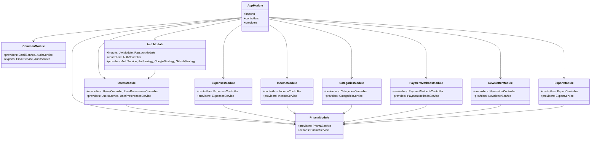

# System Modules

The CurioPay API follows a modular architecture based on NestJS's module system. Each module encapsulates a specific part of the system's functionality, promoting separation of concerns and maintainability.

## Module Architecture Diagram

## Core Modules

### AppModule

The root module that orchestrates the entire application. It imports all other modules and configures application-wide settings.

### PrismaModule

Provides database access through the Prisma ORM. Exports the PrismaService which is used by all modules requiring database access.

### CommonModule

A global module containing shared services used across the application:

- Email service for sending transactional emails
- Audit service for logging important operations
- Shared utilities, interceptors, and decorators

### AuthModule

Handles user authentication and authorization:

- JWT authentication strategy
- Social login (Google, GitHub)
- Multi-factor authentication
- Password management
- Session handling

### UsersModule

Manages user accounts and preferences:

- User registration
- Profile management
- User preferences (theme, language, currency)

## Feature Modules

### ExpensesModule

Manages expense records:

- Creating and updating expenses
- Retrieving expense reports
- Categorizing expenses
- Receipt management

### IncomeModule

Manages income records:

- Creating and updating income entries
- Income reporting
- Income categorization

### CategoriesModule

Manages expense and income categories:

- CRUD operations for categories
- Category organization (hierarchy, types)
- Default categories management

### PaymentMethodsModule

Manages payment methods:

- CRUD operations for payment methods
- Default payment methods
- Payment method preferences

### NewsletterModule

Manages newsletter subscriptions:

- Subscribe/unsubscribe functionality
- Subscription preferences

### ExportModule

Handles data export functionality:

- Exporting expenses and income data
