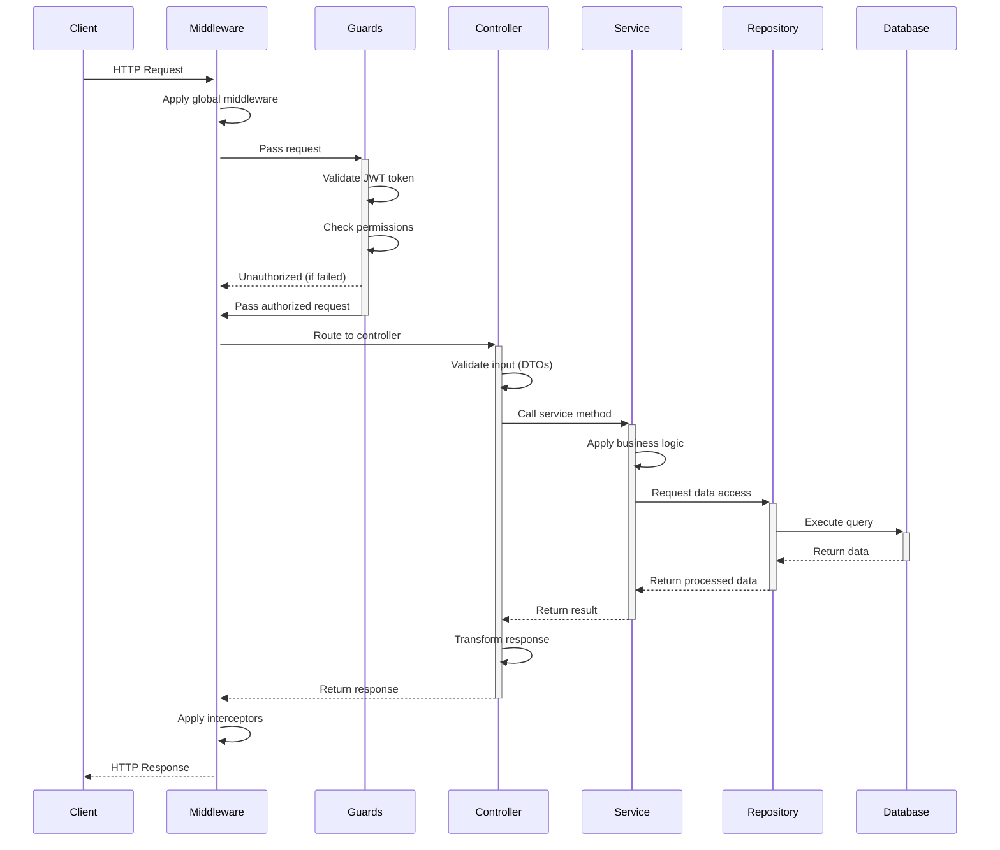
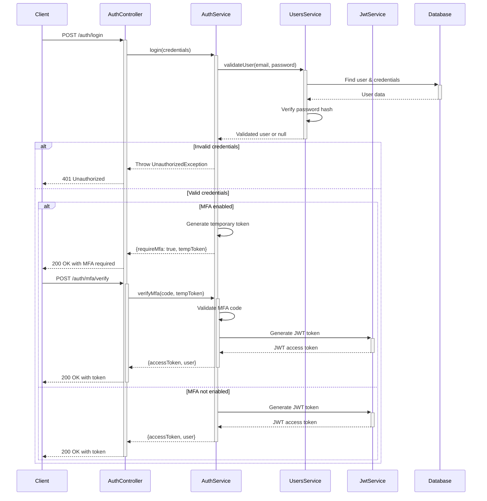
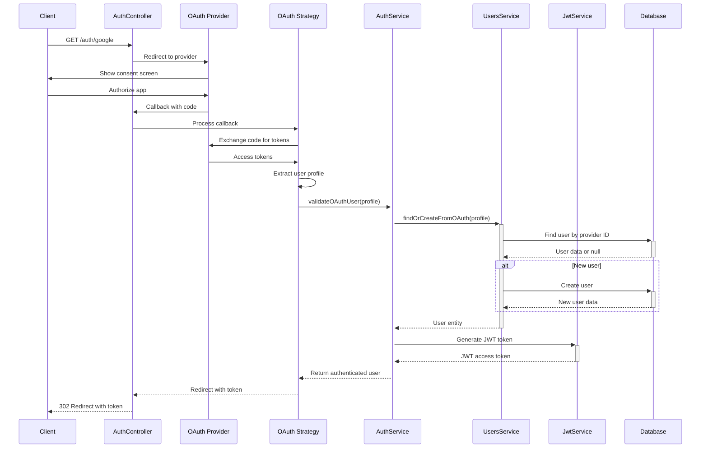
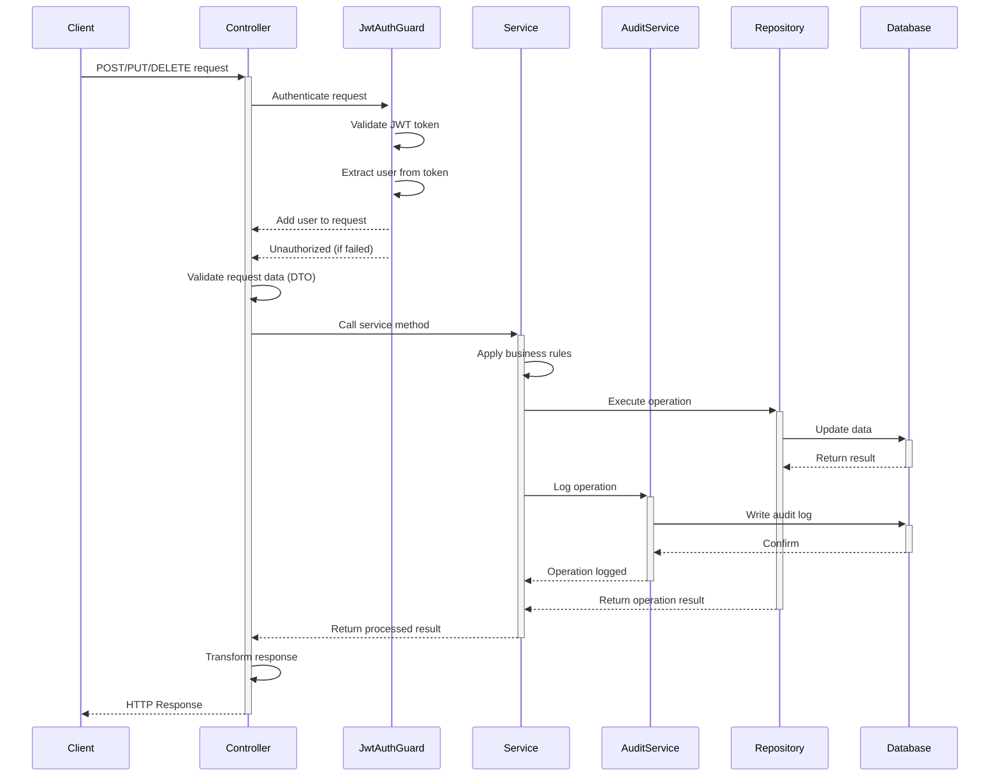
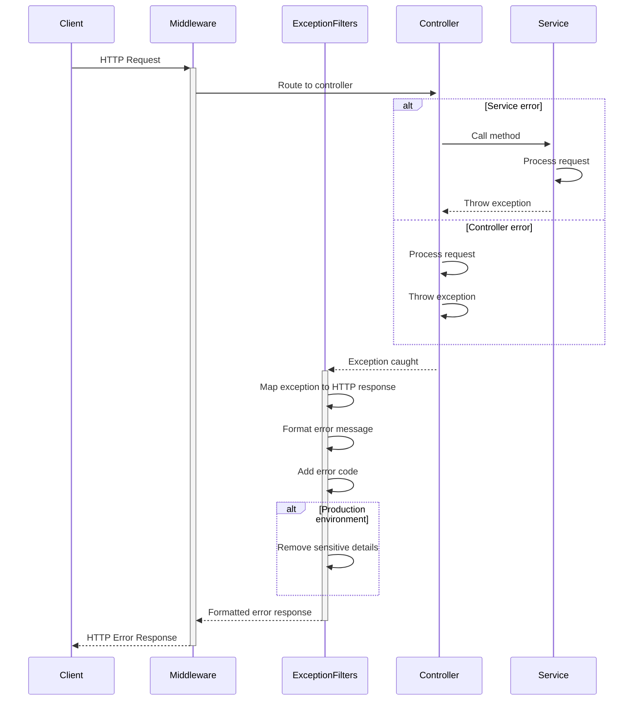

# Request Flow

This document outlines the request flow through the CurioPay API system, showing how requests are processed from client to database and back.

## Standard API Request Flow

## Authentication Flow

## OAuth Authentication Flow

## Data Modification Request Flow

## Error Handling Flow

