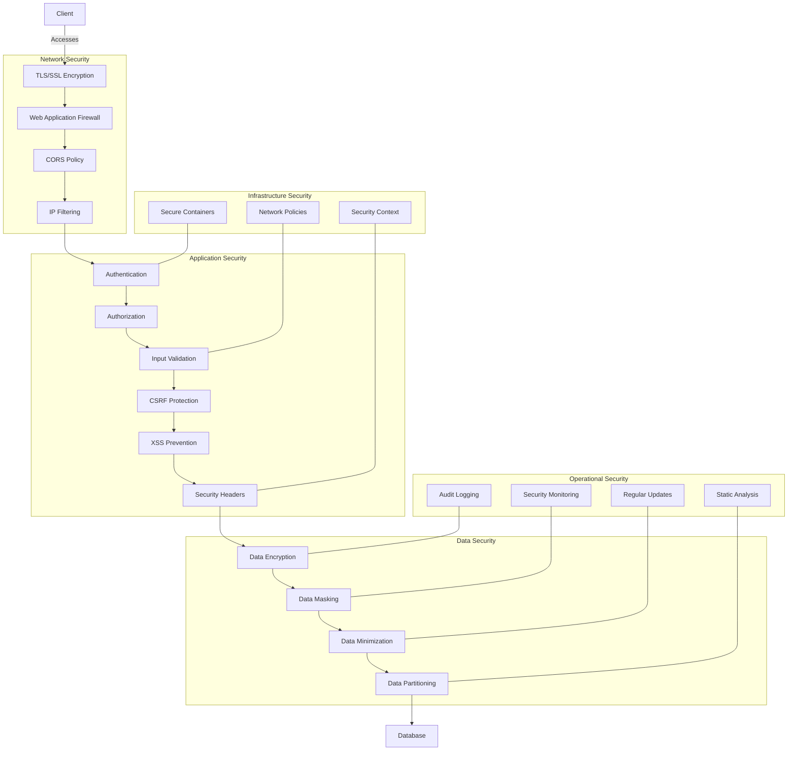
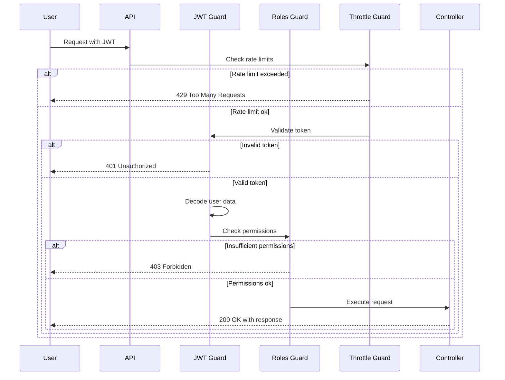
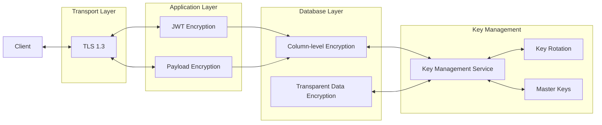
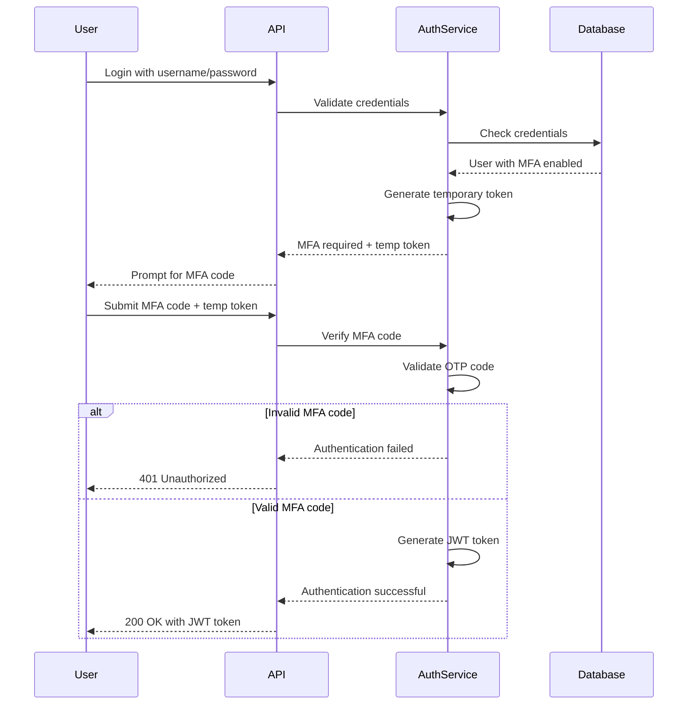
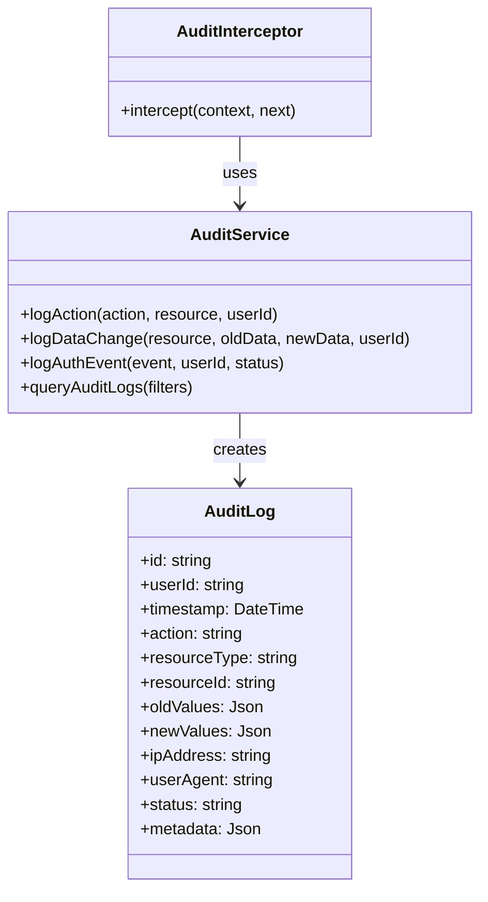

# Security Architecture

CurioPay API incorporates multiple layers of security to protect sensitive financial data and ensure user privacy.

## Security Layers

## Authentication & Authorization Flow

## Data Encryption Strategy

## Multi-Factor Authentication

## Audit Logging System

## Security Controls by Data Sensitivity

```mermaid
flowchart TD
    subgraph "Public Data"
        PD1["Category Names"]
        PD2["Public User Profiles"]
    end

    subgraph "Internal Data"
        ID1["Aggregated Statistics"]
        ID2["System Logs"]
        ID3["Expense Amounts"]
    end

    subgraph "Sensitive Data"
        SD1["User Email"]
        SD2["Full Names"]
        SD3["Transaction Details"]
    end

    subgraph "Highly Sensitive Data"
        HSD1["Password Hashes"]
        HSD2["MFA Secrets"]
        HSD3["Payment Details"]
    end

    Public["Basic Security Controls"] --> PD1
    Public --> PD2

    Standard["Standard Security Controls"] --> ID1
    Standard --> ID2
    Standard --> ID3

    Enhanced["Enhanced Security Controls"] --> SD1
    Enhanced --> SD2
    Enhanced --> SD3

    Strict["Strict Security Controls"] --> HSD1
    Strict --> HSD2
    Strict --> HSD3

    classDef public fill:#c1e1c5
    classDef internal fill:#c4def6
    classDef sensitive fill:#ffe066
    classDef highSensitive fill:#ffb3b3

    class PD1,PD2 public
    class ID1,ID2,ID3 internal
    class SD1,SD2,SD3 sensitive
    class HSD1,HSD2,HSD3 highSensitive
```

